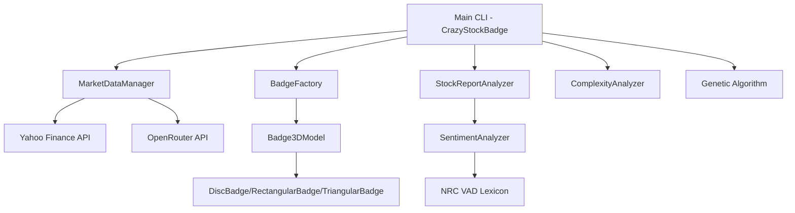
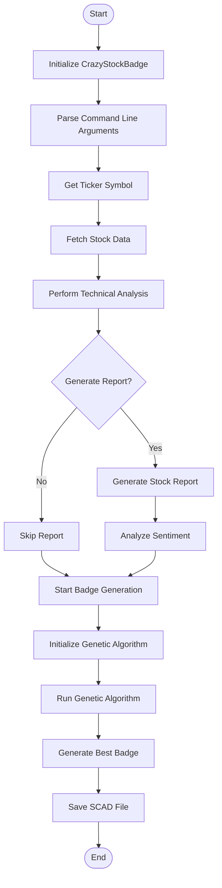
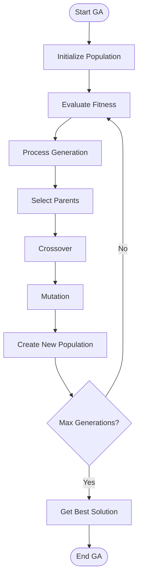
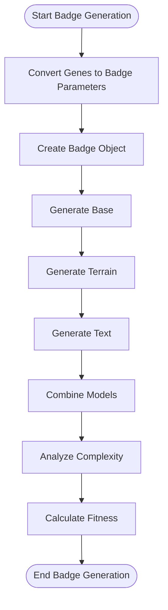
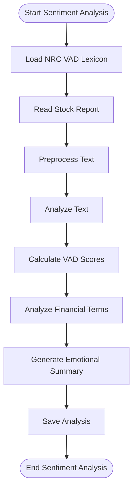
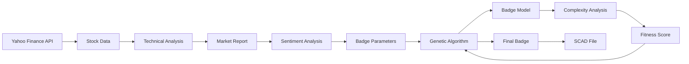

# Logical Flow Diagram of Crazy Stock Badges Code

This document provides a logical flow diagram that shows how the different components of the Crazy Stock Badges project interact and the overall program flow. The project is a system that generates 3D printable badges based on stock market data, with sentiment analysis and complexity metrics.

## High-Level Architecture

## Main Program Flow

## Genetic Algorithm Flow

## Badge Generation Process

## Sentiment Analysis Flow

## Data Flow

## Key Components and Their Relationships

1. **CrazyStockBadge (Main CLI)**: The central controller that orchestrates the entire process.
2. **MarketDataManager**: Fetches stock data and performs technical analysis.
3. **StockReportAnalyzer**: Analyzes sentiment in stock reports.
4. **BadgeFactory**: Creates different types of 3D badge models.
5. **Badge3DModel**: Base class for all badge types with common functionality.
6. **ComplexityAnalyzer**: Analyzes the complexity of 3D models for fitness evaluation.
7. **Genetic Algorithm**: Optimizes badge design for maximum "craziness" and complexity.

The program follows these main steps:
1. Fetch stock data for a given ticker symbol
2. Perform technical analysis on the data
3. Generate a market report using OpenRouter API
4. Analyze sentiment in the report
5. Use a genetic algorithm to generate a 3D badge design
6. Evaluate badge designs based on complexity metrics
7. Save the final badge as a SCAD file for 3D printing

This logical flow diagram provides a clear understanding of how the different components of the Crazy Stock Badges project interact and the overall program flow.
